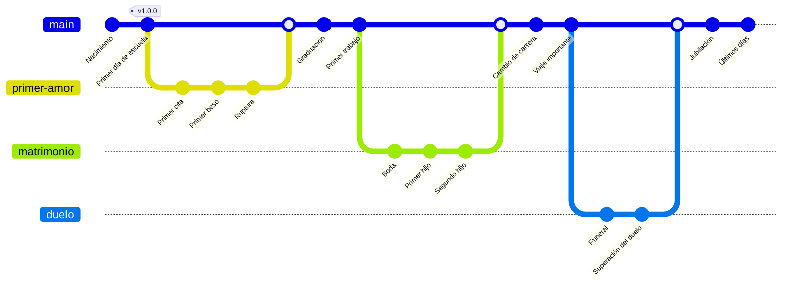

# Introduccion 

Git es un [VCS](vcs.md), sistema de control de versiones, y como su nombre indica sirve para llevar un control de todos los cambios que se quieran. 

Diferenciar entre git y [github](github.md), son cosas distintas.

Que nos aporta

<table border=1>
<tr>
<td>
    hola
</td>
</tr>
</table>

# Historia de vida en Git

Este es un ejemplo de cómo representar la vida de una persona usando Git y Mermaid.

Instalación

